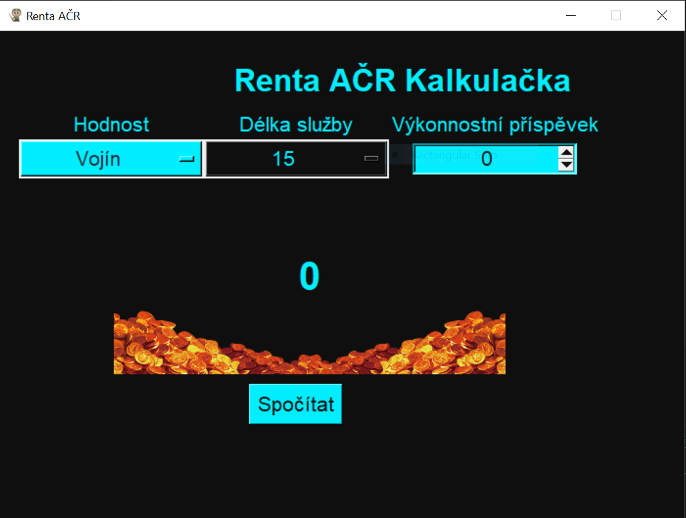
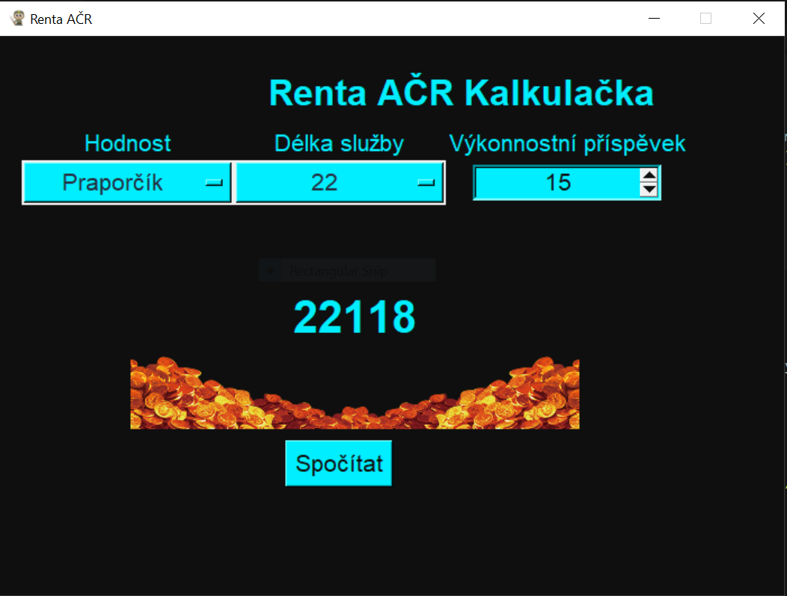

# Renta ACR calculator 💻
Renta calculator of ACR members

## 1. Project description
This calculator computes the monthly rent for Czech Army members based on inputs such as rank, years of service, and performance bonuses. For a better user experience, this project runs on a GUI built with Tkinter.

## 2. Library Installation
The libraries used in the code are listed in the `requirements.txt` file. It is recommended to use a new virtual environment and, with the package manager installed, run the following commands:
- `pip --version`                      # Verify the manager's version
- `pip install -r requirements.txt`    # Install the libraries

## 3. Running the project
Running the file `rentaacr.py` from the command line..`python rentaacr.py`
The GUI will appear and user is requested to choose following arguments: 
- rank
- years of service 
- performance bonuses

## 4. Running the project 

### Starting the program: 
`python rentaacr.py`

### Insert requested data into the calculator window:

Example:
- Hodnost: praporcik
- Delka sluzby: 22
- Vykonnostni prispevek: 15

Clik on the button 'Spocitat'

### ✅ Program output:

In the result picture you can see that ACR member in the rank of praporcik will receive 22118 czech crowns after 22 years of service. 